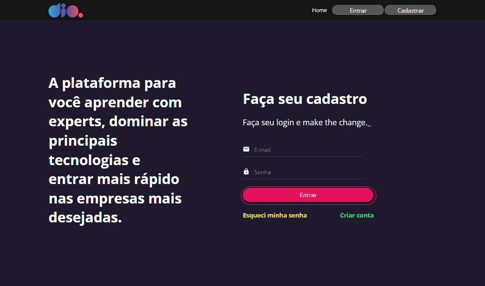
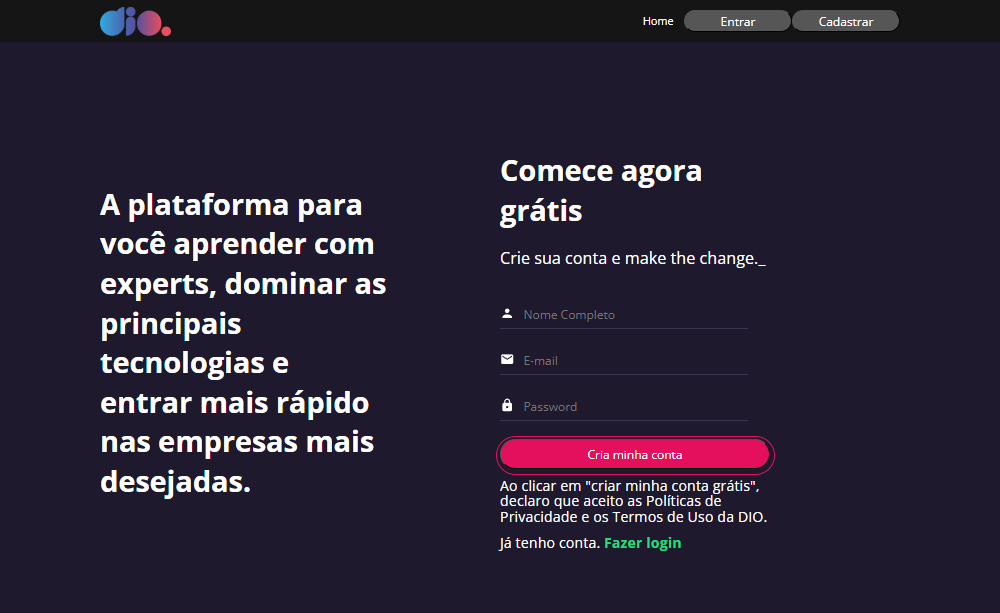
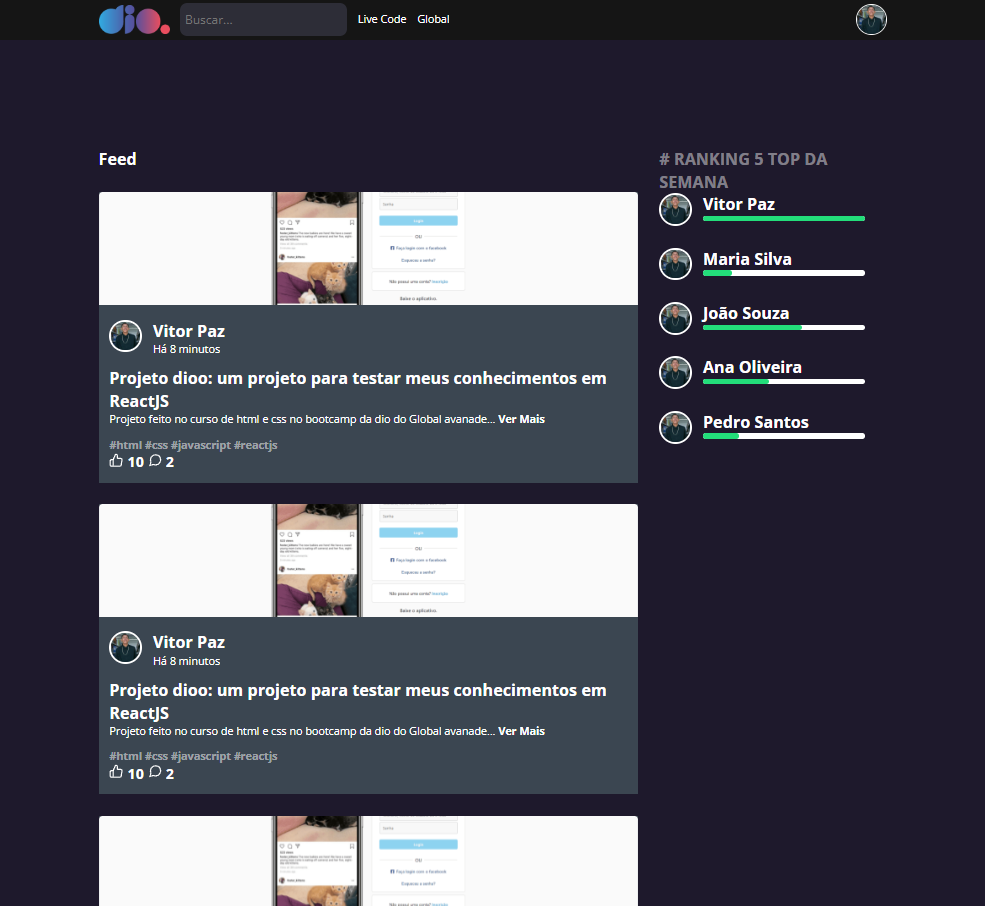

# 🚀 DIO Clone

Um clone da plataforma **Digital Innovation One (DIO)** desenvolvido com **React**, reproduzindo as telas de **Login**, **Cadastro** e **Feed**.  
O projeto foi criado com o objetivo de praticar **componentização**, **rotas**, **validação de formulários**, **consumo de API** e **estilização com Styled Components**.

---

## 🖼️ Demonstração

### 🏠 Tela Home


### 🔐 Tela de Login


### 🧾 Tela de Cadastro


### 📰 Página de Feed


---

## 🧠 Funcionalidades

- Tela de **Login** com validação de campos  
- Tela de **Cadastro** de novo usuário  
- Página de **Feed** com listagem de cards simulando o ambiente da DIO  
- Navegação entre páginas com **React Router DOM**  
- Integração com **API fake (JSON Server)** para autenticação e persistência de dados  
- Estilização com **Styled Components**  
- Validação de formulários com **React Hook Form** + **Yup**

---

## ⚙️ Tecnologias utilizadas

| Categoria | Tecnologias |
|------------|-------------|
| **Frontend** | [React 19](https://react.dev/), [React DOM](https://react.dev/reference/react-dom), [React Router DOM](https://reactrouter.com/), [Styled Components](https://styled-components.com/) |
| **Formulários** | [React Hook Form](https://react-hook-form.com/), [Yup](https://github.com/jquense/yup), [@hookform/resolvers](https://react-hook-form.com/api/useform/resolvers/) |
| **API / HTTP** | [Axios](https://axios-http.com/) |
| **Backend fake** | [JSON Server](https://github.com/typicode/json-server) |
| **Autenticação** | [bcryptjs](https://github.com/dcodeIO/bcrypt.js) |
| **Ícones** | [React Icons](https://react-icons.github.io/react-icons/) |
| **Testes** | [Testing Library](https://testing-library.com/), [Jest DOM](https://github.com/testing-library/jest-dom) |

---

## 🛠️ Como executar o projeto

### 🔹 Pré-requisitos
Certifique-se de ter instalado:
- [Node.js](https://nodejs.org/)
- [npm](https://www.npmjs.com/) ou [yarn](https://yarnpkg.com/)

### 🔹 Passos

```bash
# Clone este repositório
git clone https://github.com/Viipaxx/React-Dio-Clone.git

# Acesse a pasta do projeto
cd React-Dio-Clone

# Instale as dependências
npm install

# Inicie o servidor fake (API)
yarn api

# Em outro terminal, inicie o app React
yarn start
